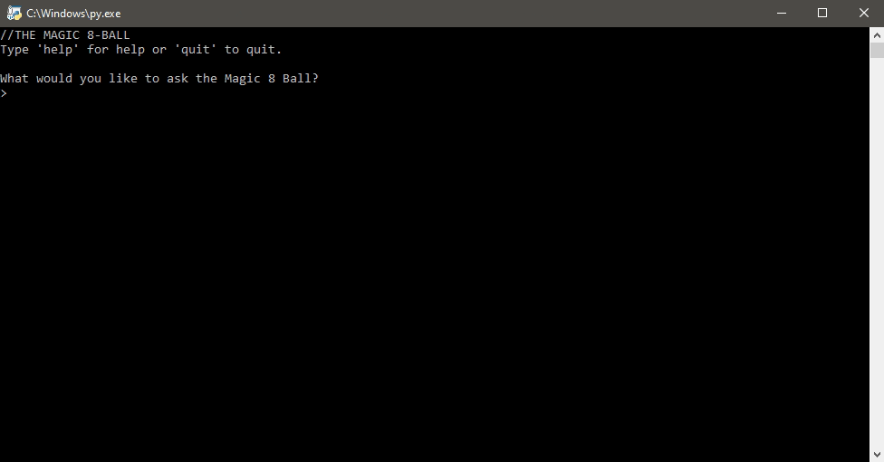

# Magic 8-Ball
This is a digital Magic 8-Ball made with Python. The orignal Magic 8-Ball was a billard's 8-ball used for fortune telling. Users would ask a yes or no question and the Magic 8-Ball would give a prediction.

## Table of Contents
- [Demo](#Demo)
- [Built With](#Built-With)
- [Running Magic 8-Ball](#Running-Magic-8-Ball)
- [License](#License)
- [Acknowledgements](#Acknowledgements)
- [Donations (Optional)](#Donations-(Optional))

## Demo
Users can then ask the Magic 8-Ball a yes/no question and recieve a prediction. Users may also ask non-yes/no questions but the answers may not make sense. Users will then return to the start screen where they can ask another question or quit.

Input is case-insensitive, feel free to use ALL CAPS, all lowercase, or MiXed CaSe. Question mark at the end of a question is not required. There are 14 possible responses to yes/no questions which are randomly picked each time and a 15th secret response (shown in the demo).

`Help` can be used to access the Help Screen and `Quit` can be used to exit from within the game.

## Built With
- [Python 3.8](https://www.python.org/) with the help of the built-in modules:
  - os
  - random

## Running Magic 8-Ball
- Install Python 3.6 or newer.
  - You can grab the latest copy from http://python.org.
- Download `magic_8.py`.
- Run `magic_8.py` and enjoy.

## License 
Distributed under the MIT License. See `LICENSE` for more information.

## Acknowledgements
- [Automate the Boring Stuff](https://automatetheboringstuff.com/) as a rough starting reference

## Donations (Optional)
Ko-fi is basically a virtual tip jar where you can support creatives for about the price of a cup of coffee.

At this time, I'm not very active on Ko-fi nor do I offer any rewards. If you love my work and feel like supporting me, hit the button below to get started.

Tipping is optional but I will appreciate any amount you choose to donate. Thank you (´• ω •`) ♡ !

